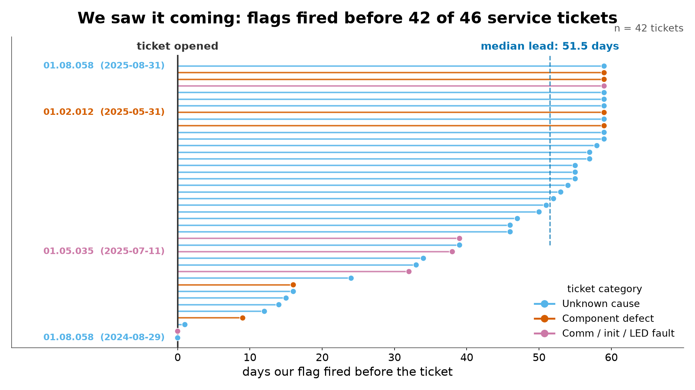
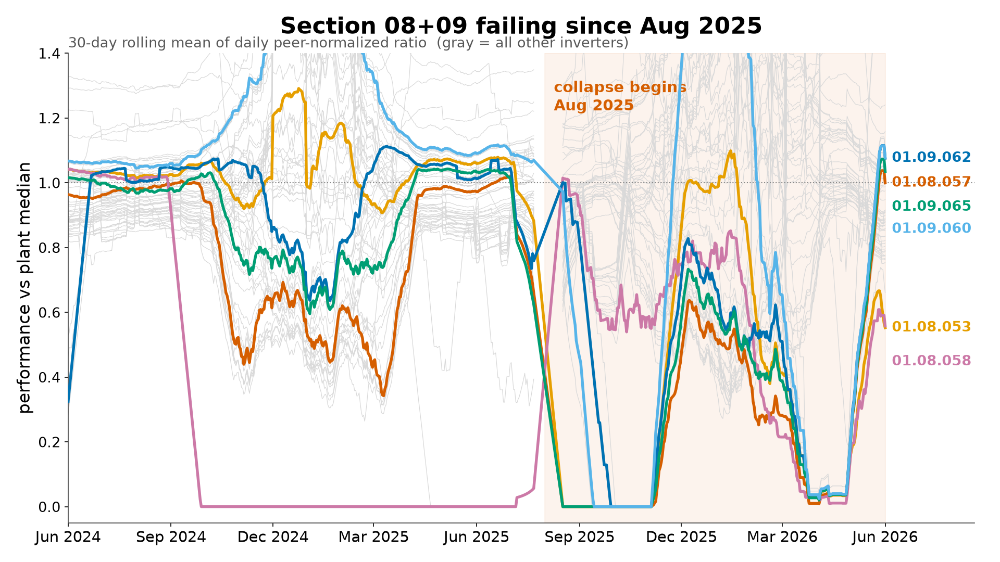
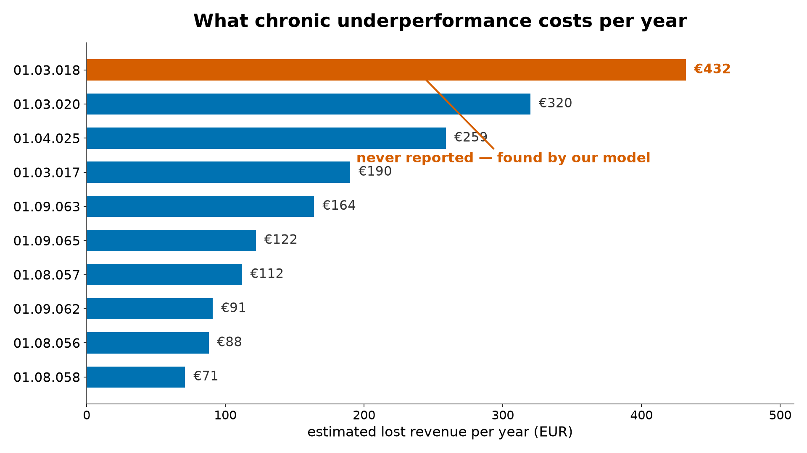
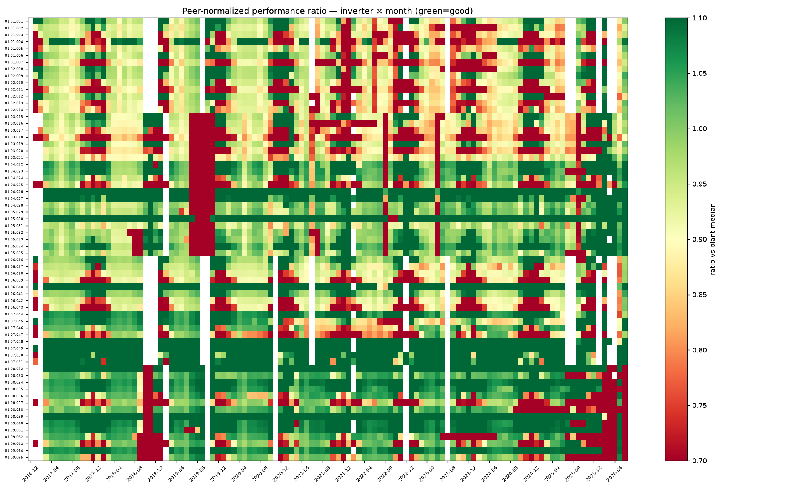
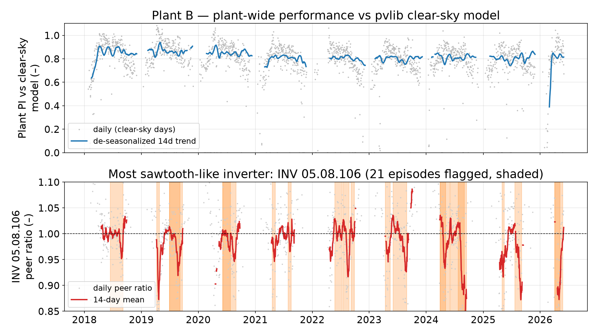
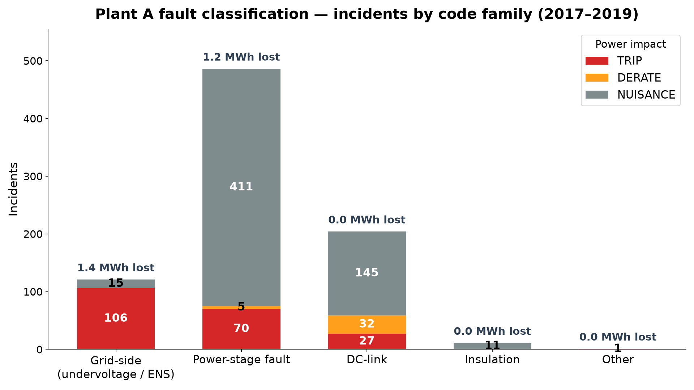

# Plant Sentinel — a digital twin that pays for itself

**Team Syz · Energy Hack Munich 2026 · Challenge #2.1 — Enerparc: Digital Twin of a Solar Plant**

A peer-normalized performance twin for PV plants. We ran it on your real data:
**42 of the last 46 inverter-specific service tickets were visible in the performance data
before the ticket was opened — median lead time 51.5 days.** Seven weeks of warning,
validated against your own ticket log.

> 4-minute video is the primary deliverable. This README is the evidence trail behind it.

---

## What we found in YOUR data

All numbers below come from Plant A (990k rows, 5-min resolution, 2016-12 → 2026-06, 65 inverters)
and Plant B (107 inverters, 7.87 MWp, 2018-01 → 2026-06). Full details: [`runs/plant_a/FINDINGS.md`](runs/plant_a/FINDINGS.md), [`runs/plant_b/SOILING_FINDINGS.md`](runs/plant_b/SOILING_FINDINGS.md).

### 1. Failures are predictable — 42/46 tickets flagged in advance, median 51.5 days early

Back-tested against the real service-ticket log (defective capacitors, boards, insulation faults).
42 of 46 inverter-specific tickets were preceded by our performance flag. Data: [`runs/plant_a/ticket_leadtimes.csv`](runs/plant_a/ticket_leadtimes.csv).



### 2. ACTIVE failure in progress: sections 01.08 + 01.09, collapsing since Aug 2025

Several inverters now at 0.35–0.50 of peer output (01.08.057: 0.35, 01.09.065: 0.38),
each with ~740–840 outage hours in the last 365 days. Realized loss so far ~€1,200/yr —
but **€42,325/yr of revenue is at risk** (14 inverters, 368 kWp trending toward zero).
Data: [`runs/plant_a/collapse_cost.csv`](runs/plant_a/collapse_cost.csv), [`runs/plant_a/outage_hours_honest.csv`](runs/plant_a/outage_hours_honest.csv).



### 3. Your monitoring has a blind spot — and this collapse sits inside it

Error-code telemetry ends in Nov 2019 and **never covered sections 08/09**
(9,211 error events 2017–2019, zero after). The active collapse is invisible to error
logging; only performance analysis catches it.

### 4. Unreported fault: INV 01.03.018 — one year at 70%, zero tickets

Peer ratio 0.70, below 0.95 on 272 of 317 days, ≈ €432/yr lost. No service ticket exists.
Plant-wide: **€64,247 of underperformance across 444 material episodes (9.4 yrs) has no
inverter-specific ticket** — only 33 of 477 episodes (7%) were ever ticketed.
Data: [`runs/plant_a/flag_episodes_material.csv`](runs/plant_a/flag_episodes_material.csv), [`runs/plant_a/underperformers.csv`](runs/plant_a/underperformers.csv).



The full 9.4-year history, 65 inverters × 113 months — the 2019 section outage, the
2025 collapse, and the chronic underperformers are all visible:



### 5. Plant B: soiling and shading, quantified per inverter

37 of 107 inverters show soiling-style decline-and-recovery sawtooths. Clearest case:
INV 05.08.106 (west edge, last row) — 21 episodes over 8.5 years, max decline 16.5%,
deepening every spring→August with a September snap-back: seasonal vegetation shading
or edge soiling. Winter inter-row shading costs a typical interior row up to 25% in Nov–Feb.
Pyranometer validated against pvlib clear-sky (+3% drift over 8.5 yrs).
Data: [`runs/plant_b/soiling_per_inverter.csv`](runs/plant_b/soiling_per_inverter.csv).



### 6. 9,211 raw alarms → a ranked work list: 71% are nuisance

823 merged incidents, classified by actual power impact: **25% TRIP / 4% DERATE / 71% NUISANCE**.
Grid undervoltage (ENS) is the real energy killer (1.4 of 2.6 MWh total estimated loss);
DC-link and insulation alarms are almost pure noise → deprioritize them in O&M alarm handling.
Details: [`runs/plant_a/faults/FAULT_CLASSIFICATION.md`](runs/plant_a/faults/FAULT_CLASSIFICATION.md).



**Bonus:** ~8 inverters sit permanently above 1.1 peer ratio (01.04.026/27, 01.05.030/31,
01.07.048–051, …). That is not overperformance — it is a stale kWp value in the asset
register. Fixing the master data sharpens every yield calculation on the plant.

---

## Method in 30 seconds

- **Peer-normalized performance index.** Every 5 minutes, each inverter's kWp-normalized
  output is divided by the plant median at that exact timestamp. Clouds, seasons, and rain
  hit all inverters at once and cancel out. 1.0 = healthy; below = trouble.
- **Curtailment-aware.** Grid curtailment (EVU/DV < 99%) looks exactly like a fault.
  We filter it explicitly (0.27% of steps on Plant A) — skip this and you flag healthy
  inverters all day.
- **Validated against tickets.** Every flag was back-tested against the real service-ticket
  log. The 42/46 recall and 51.5-day median lead time are checkable claims, not projections.
- Plant B adds a pvlib Ineichen clear-sky reference and a sawtooth heuristic
  (decline >3% over ≥14 d, recovery >2% within 7 d) for soiling detection.

## Challenge brief coverage

All five suggested directions covered:

| Direction | ✓ | Result | Artifact |
|---|---|---|---|
| Anomaly detection | ✓ | Active 08/09 collapse + unreported INV 01.03.018 found from data alone | [`runs/plant_a/FINDINGS.md`](runs/plant_a/FINDINGS.md) |
| Soiling detection | ✓ | 37/107 inverters with sawtooths; 21-episode headline case; winter shading quantified | [`runs/plant_b/SOILING_FINDINGS.md`](runs/plant_b/SOILING_FINDINGS.md) |
| Fault classification | ✓ | 823 incidents → 25% TRIP / 4% DERATE / 71% NUISANCE; ENS = costliest family | [`runs/plant_a/faults/FAULT_CLASSIFICATION.md`](runs/plant_a/faults/FAULT_CLASSIFICATION.md) |
| Performance-ratio modelling | ✓ | Per-inverter PI + peer ratio, 9.4 yrs × 65 inverters, monthly heatmap | [`runs/plant_a/heatmap_monthly_ratio.png`](runs/plant_a/heatmap_monthly_ratio.png) |
| Ticket intelligence | ✓ | 42/46 tickets flagged in advance, median 51.5 d; 7% ticketing coverage measured | [`runs/plant_a/ticket_leadtimes.csv`](runs/plant_a/ticket_leadtimes.csv) |

Plus an interactive dashboard: [`runs/plant_a/dashboard/index.html`](runs/plant_a/dashboard/index.html)
— self-contained HTML, 65 clickable inverter tiles, per-inverter history with ticket markers.

## Reproduce

```bash
python -m venv .venv && source .venv/bin/activate
pip install -r requirements.txt
pip install pvlib            # Plant B clear-sky model

python src/twin/synthetic_test.py   # smoke test: plants 3 fault types, must detect all 3
```

Raw monitoring data is not in git. Place the challenge bundle under `data/raw/` and point
the runners at it:

```bash
export PLANT_A_BASE="data/raw/EP-Challenge-Final -/Plant A (start here)"
python src/twin/run_plant_a.py       # -> runs/plant_a/ (findings, CSVs, heatmap, dashboard)
python src/twin/run_plant_b.py       # -> runs/plant_b/ (soiling findings, chart)
python src/twin/fault_classify.py    # -> runs/plant_a/faults/
```

All outputs in `runs/` were generated by these scripts — the numbers in this README are
reproducible line by line.

## Limitations (read this)

- **Relative method.** Because inverters are measured against each other, plant-wide
  degradation that hits every inverter equally is invisible. Catching it needs an absolute
  baseline (satellite irradiance or the validated pyranometer, as done for Plant B).
- **€ figures are tariff-based estimates.** Lost energy × feed-in tariff. The 08/09 number
  is deliberately framed as *at-risk* revenue (€42,325/yr), not realized loss (~€1,200/yr).
- **Tickets are sparse ground truth.** Our flags fire ~10× more often than tickets exist —
  consistent with the measured telemetry blind spot, so flag precision cannot be fully
  scored. The defensible stat is lead-time recall: 42/46.
- **Winter months are noisy** (low irradiation) — irradiation-weighted ratios are the next step.
- ~8 inverters with ratio >1.1 are flagged as suspected stale kWp, not yet field-verified.

---

## Team

**Team Syz** — Orkhan Karimov · Maxat Issaliyev — contact: theorkhn@gmail.com

Built in one weekend, 2 humans + 2 Claude agents working in parallel
(`HANDOFF.md` = shared state, small commits, push often). `archive/grid-agent-3.1/` holds
a previous challenge prototype, kept for reference. Video storyboard:
[`docs/VIDEO_STORYBOARD.md`](docs/VIDEO_STORYBOARD.md) · One-page summary:
[`docs/ONE_PAGER.md`](docs/ONE_PAGER.md).
